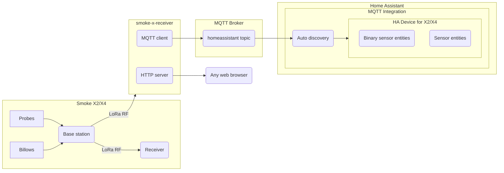

# ThermoWorks Smoke X2 and X4 Receiver

This is an ESP32+LoRa application that receives the RF signal from a [ThermoWorks Smoke X2](https://www.thermoworks.com/smokex2/) or [Smoke X4](https://www.thermoworks.com/smokex4/) remote thermometer and publishes the information to an MQTT broker. This will work alongside any existing Smoke X2/X4 receivers (i.e. all paired receivers will still function). This project was designed specifically to integrate with Home Assistant, but may also be used with any other MQTT-based application. In addition, this application may operate in a standalone fashion (WLAN interface in AP mode without MQTT or Home Assistant) for field use.

> **Note**
> This application is **<ins>not</ins>** compatible with the original [ThermoWorks Smoke](https://www.thermoworks.com/smoke/) or [ThermoWorks Signals](https://www.thermoworks.com/signals/) products.

---

- [Motivation](#motivation)
- [Requirements](#requirements)
- [Build](#build)
- [Initial Application Setup](#initial-application-setup)
- [MQTT Schema](#mqtt-schema)
- [Home Assistant](#home-assistant)
- [HTTP API](#http-api)
- [LoRa](#lora)
- [Development](#development)

---

## Motivation

The Smoke X is solidly built, accurate, has great RF range, and doesn't need the internet to function. But the provided receiver unit only shows current probe readings, with no means of recording or tracking trends.


This application allows Smoke X users to collect the temperature data from the RF signal and visualize the temperature history through a web UI (served by the ESP32), a Home Assistant dashboard, and/or any other data visualization tools.


All data is acquired, processed, and stored locally as shown below:



Even if you're not a Home Assistant user, you can still use this application's built-in web interface to monitor your temperatures and watch for trends.

## Requirements

### Hardware

An ESP32 with attached Semtech LoRa transceiver operating in the 915 MHz ISM band is required. A combined ESP32+LoRa development board such as the Heltec WiFi LoRa 32 [V2](https://heltec.org/project/wifi-lora-32/) or [V3](https://heltec.org/project/wifi-lora-32-v3/) is ideal, but any ESP32 board with a SPI connected SX1276 or SX1262 should work.

- Both the Heltec WiFi LoRa 32 V2(SX1276) and V3(SX1262) have been tested to work with this application

### Software

- ESP-IDF SDK v4.4 [installation instructions](https://docs.espressif.com/projects/esp-idf/en/release-v4.4/esp32/get-started/index.html)
- Node.js and npm (to build the web UI assets)

---

## Build

### Prepare Environment

- Activate ESP-IDF
  ```bash
  $ source /path/to/esp-idf/export.sh
  ```
- Clone this repo (including its submodules) and enter the directory.
  ```bash
  $ git clone --recurse-submodules git@github.com:G-Two/smoke-x-receiver.git
  $ cd smoke-x-receiver
  ```

### Configure

- The default configuration for this project was written for the Heltec WiFi LoRa 32 _v3_ (based on the SX1262). If you are using this exact hardware, you can can probably skip this section. If you are running on any other hardware, want to customize the build, or if the default build doesn't work, you'll need to run menuconfig:

  ```bash
  $ idf.py menuconfig
  ```

  - **NOTE:** If you are using an SX1276 (such as the Heltec WiFi LoRa 32 _v2_), you must select the SX127x driver in the "Smoke X Receiver HW/App Config" menu and configure the SX127x SPI pin assignments

    - The Heltec WiFi LoRa 32 v2 SPI assignments are:
      - CS/NSS: 18
      - RST: 14
      - MISO: 19
      - MOSI: 27
      - SCK: 5

  - Additional configuration changes may be needed to support your specific hardware or other needs

### Build and Flash

- Connect your ESP32 to your computer and run:
  ```bash
  $ idf.py set-target esp32s3 # If using a Heltec WiFi LoRa 32 v3, otherwise set target as appropriate to your hardware
  $ idf.py flash
  ```

The application and web assets will be built and written to the ESP32 flash.

---

## Initial Application Setup

After the ESP32 is flashed, several items need to be configured and saved to NVRAM. The configuration of these items will persist after ESP32 reset as well as application software updates.

- WLAN network configuration
- Smoke X pairing
- MQTT configuration

### WLAN Network Configuration

The device will default to AP mode if WLAN information has not been configured, or if the connection fails. The default AP mode information (configurable in menuconfig) is:

- SSID: "Smoke X Receiver"
- PSK: "The extra B is for BYOBB"

Connect to the ESP32's AP and use a web browser to navigate to http://192.168.4.1/wlan
You will be presented with a self-explanatory web UI to configure the device to your home network. WPA2-PSK and WPA2-Enterprise (EAP-TTLS) are supported. Once you apply your network authentication information, the device will reset and attempt to join your home network. The ESP32 will supply a DHCP client hostname request for `smoke_x`. Once you find the ESP32 on your home network, you may proceed with the remainder of the setup process. If the ESP32 fails to join your network, it will revert to default AP mode.

### Smoke X Pairing

The "Pairing" tab of the web UI will indicate that the device requires pairing to a Smoke X base unit. If the device is in an unpaired state, it will alternate monitoring the two sync channels (920 MHz for X2, 915 MHz for X4), and will pair with the first Smoke X sync transmission it receives. To pair, place the Smoke X base unit in sync mode which will cause it to send sync bursts every three seconds. Once the ESP32 receives and parses the burst, it will transmit a sync response on the target frequency, and the base unit will return to normal operation. At this point you can confirm in the web UI that the device is paired with a specific device ID and frequency. This is the only time the ESP32 will transmit a LoRa signal. The device may always be unpaired via the web UI. Pairing/unpairing of the ESP32 will not affect the pairing status of any other devices.

Once paired, the status page will display a temperature graph.

### MQTT Configuration

The web UI is also used to configure the device to connect to an MQTT broker. The MQTT URI is the only mandatory field, the rest are optional and will depend on your specific MQTT broker configuration. MQTTS server authentication is supported by entering a trusted CA PEM via the web UI. PKI client auth is not currently supported.

## MQTT Schema

If MQTT is configured and enabled, the application will publish status messages upon receipt of an RF transmission from the Smoke X base station. The base station transmits every thirty seconds. The published message contents are:

```json
{
  "probe_1_attached": "ON",
  "probe_1_alarm": "ON",
  "probe_1_temp": 70.4,
  "probe_1_max": 185,
  "probe_1_min": 32,
  "billows_target": "offline",
  "probe_2_attached": "ON",
  "probe_2_alarm": "ON",
  "probe_2_temp": 70.4,
  "probe_2_max": 91,
  "probe_2_min": 50,
  "billows_attached": "OFF"
}
```

_NOTE:_ X4 devices will also include additional data for probes 3 and 4

---

## Home Assistant

This application supports [Home Assistant MQTT discovery](https://www.home-assistant.io/docs/mqtt/discovery/). If your Home Assistant instance has the MQTT integration configured for discovery, the following Smoke X sensors will automatically be added:

- Sensors
  - Current Temperature
  - Alarm Min Temperature
  - Alarm Max Temperature
  - Billows Set Temperature
- Binary Sensors
  - Probe Attached
  - Billows Attached
  - Alarm Enabled

After successful connection to the MQTT broker, the device will configure each sensor by publishing discovery messages similar to the following (one for each entity):

```json
{
  "dev": {
    "name": "Smoke X Receiver",
    "identifiers": "|ABC12",
    "sw_version": "0.1.0",
    "model": "X2",
    "manufacturer": "ThermoWorks"
  },
  "exp_aft": 120,
  "pl_not_avail": "offline",
  "stat_t": "homeassistant/smoke-x/state",
  "dev_cla": "temperature",
  "unit_of_meas": "°F",
  "uniq_id": "smoke-x_probe_1_temp",
  "name": "Smoke X Probe 1 Temp",
  "val_tpl": "{{value_json.probe_1_temp}}"
}
```

In addition, the application will subscribe to the Home Assistant status topic for birth announcements. If Home Assistant restarts, the birth announcement will signal to the application to re-publish the discovery messages. Default Home Assistant topic names are used, but may be customized in the ESP32 web UI.

---

## HTTP API

The application provides an HTTP API (used by the web UI's temperature history graph) that may also be used by any other client that is able to send HTTP requests to the ESP32.

### GET /data

Response:

```json
{
  "probe_1": {
    "current_temp": 95.3,
    "alarm_max": 185,
    "alarm_min": 32,
    "history": [95.1, 95.2, 95.3]
  },
  "probe_2": {
    "current_temp": 165.9,
    "alarm_max": 91,
    "alarm_min": 50,
    "history": [165.7, 165.8, 165.9]
  },
  "billows": false
}
```

_NOTE:_ X4 devices will also include additional data for probes 3 and 4

---

## Development

PRs to fix bugs or enhance/add functionality are welcome! If you have successfully built the application, you have everything needed to modify it.

### Debugging

It may be helpful to monitor the ESP32 logs during initial application setup to aid in debugging. While the ESP32 is still plugged into your computer, monitor logs by running:

```
$ idf.py monitor
```

### Main Application

This application is built with the ESP-IDF v4 SDK and has external dependencies with the following LoRa modem drivers:

- [esp-idf-sx126x](https://github.com/nopnop2002/esp-idf-sx126x)
- [esp-idf-sx127x](https://github.com/nopnop2002/esp-idf-sx127x)

### Web UI

The web interface is written in Vue and is loaded onto the ESP32 flash file system as compressed static web assets which are served by the ESP32 web server. To aid in development and manual testing, the web interface can be previewed with:

```
$ ./mock_web_ui.sh
```

### TODO

- Do something useful with the OLED display on Heltec LoRa 32 devices
- Refine web UI
