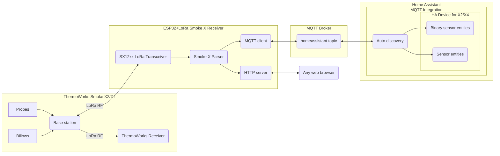

# ThermoWorks Smoke X2 and X4 Receiver

This is an ESP32+LoRa application that receives the RF signal from a [ThermoWorks Smoke X2](https://www.thermoworks.com/smokex2/) or [Smoke X4](https://www.thermoworks.com/smokex4/) remote thermometer and publishes the information to an MQTT broker. This will work alongside any existing Smoke X2/X4 receivers (i.e. all paired receivers will still function). This project was designed specifically to integrate with Home Assistant, but may also be used with any other MQTT-based application. In addition, this application may operate in a standalone fashion (WLAN interface in AP mode without MQTT or Home Assistant) for field use.

> **Note**
> This application is **<ins>not</ins>** compatible with the original [ThermoWorks Smoke](https://www.thermoworks.com/smoke/) or [ThermoWorks Signals](https://www.thermoworks.com/signals/) products.

---

- [Motivation](#motivation)
- [Hardware](#hardware)
- [Install](#install)
- [Initial Application Setup](#initial-application-setup)
- [MQTT Schema](#mqtt-schema)
- [Home Assistant](#home-assistant)
- [HTTP API](#http-api)

Build from source, development setup, and contribution guidelines are in [CONTRIBUTING.md](CONTRIBUTING.md).

---

## Motivation

The Smoke X is solidly built, accurate, has great RF range, and doesn't need the internet to function. But the provided receiver unit only shows current probe readings, with no means of recording or tracking trends.


This application allows Smoke X users to collect the temperature data from the RF signal and visualize the temperature history through a web UI (served by the ESP32), a Home Assistant dashboard, and/or any other data visualization tools.


All data is acquired, processed, and stored locally as shown below:


```mermaid
flowchart LR
  base <-->|LoRa RF| lora_sx12xx(SX12xx LoRa Transceiver)
  mqclient <--> mq
  mq <--> ha
  web <--> browser(Any web browser)

  subgraph ThermoWorks Smoke X2/X4
    Probes --> base(Base station) -->|LoRa RF| recv(ThermoWorks Receiver)
    Billows --> base
  end

  subgraph esp32 [ESP32+LoRa Smoke X Receiver]
    lora_sx12xx --> smoke_x_parser(Smoke X Parser)
    smoke_x_parser --> mqclient(MQTT client)
    smoke_x_parser --> web(HTTP server)
  end

  subgraph mqttb [MQTT Broker]
    mq(homeassistant topic)
  end

  subgraph Home Assistant
    mq_int
  end

  subgraph ha_dev [HA Device for X2/X4]
    e1(Binary sensor entities)
    e2(Sensor entities)
  end

  subgraph mq_int [MQTT Integration]
    ha(Auto discovery) --> e1
    ha(Auto discovery) --> e2
    ha_dev
  end
```

Even if you're not a Home Assistant user, you can still use this application's built-in web interface to monitor your temperatures and watch for trends.

## Hardware

An ESP32 with attached Semtech LoRa transceiver operating in the 915 MHz ISM band is required. A combined ESP32+LoRa development board such as the Heltec WiFi LoRa 32 [V2](https://heltec.org/project/wifi-lora-32/) or [V3](https://heltec.org/project/wifi-lora-32-v3/) is ideal, but any ESP32 board with a SPI connected SX1276 or SX1262 should work.

| Board                                                                 | ESP32 Chip | LoRa   | Status                                                         |
| --------------------------------------------------------------------- | ---------- | ------ | -------------------------------------------------------------- |
| [Heltec WiFi LoRa 32 V2](https://heltec.org/project/wifi-lora-32/)    | ESP32      | SX1276 | Tested                                                         |
| [Heltec WiFi LoRa 32 V3](https://heltec.org/project/wifi-lora-32-v3/) | ESP32-S3   | SX1262 | Tested                                                         |
| [Heltec WiFi LoRa 32 V4](https://heltec.org/project/wifi-lora-32-v4/) | ESP32-S3   | SX1262 | Untested — same ESP32 chip and GPIO as V3; use the V3 firmware |

- Build-tool requirements (ESP-IDF, Node.js, CMake) are listed in [CONTRIBUTING.md](CONTRIBUTING.md) and are only needed if you're building from source

---

## Install

The easiest way to get firmware on a supported board is the [browser-based installer](https://g-two.github.io/smoke-x-receiver/) — plug a Heltec WiFi LoRa 32 V2 or V3 into your USB port and click "Install" from any WebSerial-capable browser (Chrome, Edge, Brave, Firefox, and others). It auto-detects the chip and flashes the matching binary from the latest GitHub release.

### Manual flashing with esptool

If you prefer to flash manually, download the merged binary for your board from the [latest GitHub release](https://github.com/G-Two/smoke-x-receiver/releases/latest):

- `smoke-x-receiver-heltec-v2.bin` — Heltec WiFi LoRa 32 V2 (ESP32 + SX1276)
- `smoke-x-receiver-heltec-v3.bin` — Heltec WiFi LoRa 32 V3 or V4 (ESP32-S3 + SX1262)

Install esptool if you don't already have it:

```bash
pip install esptool
```

Then flash (replace `/dev/cu.usbserial-0001` with your actual port — `ls /dev/cu.usbserial-*` on macOS, `ls /dev/ttyUSB*` or `ls /dev/ttyACM*` on Linux):

```bash
# Heltec WiFi LoRa 32 V2
python -m esptool --chip esp32 -p /dev/cu.usbserial-0001 -b 460800 \
    write_flash 0x1000 smoke-x-receiver-heltec-v2.bin

# Heltec WiFi LoRa 32 V3 or V4
python -m esptool --chip esp32s3 -p /dev/cu.usbserial-0001 -b 460800 \
    write_flash 0x0 smoke-x-receiver-heltec-v3.bin
```

If you'd rather build from source (to customize the firmware, run a development version, or use a board the installer doesn't recognize), see [CONTRIBUTING.md](CONTRIBUTING.md).

---

## Initial Application Setup

After the ESP32 is flashed, several items need to be configured and saved to NVRAM. The configuration of these items will persist after ESP32 reset as well as application software updates.

- WLAN network configuration
- Smoke X pairing
- MQTT configuration

### WLAN Network Configuration

**Improv-Serial (easiest, PSK networks only)**

After browser-flashing, the install dialog runs [Improv-Serial](https://www.improv-wifi.com/) — enter your SSID and password directly in the browser and the device connects without rebooting. The dialog will show the device URL when it succeeds. This method supports WPA2/WPA3 personal (PSK) networks only.

**AP-mode setup (enterprise networks, or if Improv was skipped)**

The device falls back to AP mode if no network is configured, if the Improv step was skipped, or if the configured network is unreachable. Default AP credentials (configurable in menuconfig):

- SSID: `Smoke X Receiver`
- PSK: `The extra B is for BYOBB`

Connect to the ESP32's AP and open http://192.168.4.1/wlan in a browser. The configuration page supports WPA2/WPA3-PSK and WPA2/WPA3-Enterprise (EAP-TTLS). Once you apply your settings the device attempts to join the network; if it fails it returns to AP mode. The ESP32 requests the DHCP hostname `smokex` and its IP address will be shown on the OLED display.

### Smoke X Pairing

The "Pairing" tab of the web UI will indicate that the device requires pairing to a Smoke X base unit. If the device is in an unpaired state, it will alternate monitoring the two sync channels (920 MHz for X2, 915 MHz for X4), and will pair with the first Smoke X sync transmission it receives. To pair, place the Smoke X base unit in sync mode which will cause it to send sync bursts every three seconds. Once the ESP32 receives and parses the burst, it will transmit a sync response on the target frequency, and the base unit will return to normal operation. This is the only time the ESP32 will transmit a LoRa signal. At this point you can confirm in the web UI that the device is paired with a specific device ID and frequency. The device may always be unpaired via the web UI. Pairing/unpairing of the ESP32 will not affect the pairing status of any other devices.

Once paired, the status page will display a temperature graph.

### MQTT Configuration

The web UI is also used to configure the device to connect to an MQTT broker. The MQTT URI is the only mandatory field, the rest are optional and will depend on your specific MQTT broker configuration. MQTTS server authentication is supported by entering a trusted CA PEM via the web UI. Client certificate authentication is also supported.

## MQTT Schema

If MQTT is configured and enabled, the application will publish status messages upon receipt of an RF transmission from the Smoke X base station. The base station transmits every thirty seconds. The message content that this application publishes is in the following format:

```json
{
  "probe_1_attached": "ON",
  "probe_1_alarm": "ON",
  "probe_1_temp": 70.4,
  "probe_1_max": 185,
  "probe_1_min": 32,
  "billows_target": "offline",
  "probe_2_attached": "ON",
  "probe_2_alarm": "ON",
  "probe_2_temp": 70.4,
  "probe_2_max": 91,
  "probe_2_min": 50,
  "billows_attached": "OFF"
}
```

_NOTE:_ X4 devices will also include additional data for probes 3 and 4

---

## Home Assistant

This application supports [Home Assistant MQTT discovery](https://www.home-assistant.io/docs/mqtt/discovery/). If your Home Assistant instance has the MQTT integration configured for discovery, the following Smoke X sensors will automatically be added:

- Sensors
  - Current Temperature
  - Alarm Min Temperature
  - Alarm Max Temperature
  - Billows Set Temperature
- Binary Sensors
  - Probe Attached
  - Billows Attached
  - Alarm Enabled

After successful connection to the MQTT broker, the device will configure each sensor by publishing discovery messages similar to the following (one for each entity):

```json
{
  "dev": {
    "name": "Smoke X Receiver",
    "identifiers": "|ABC12",
    "sw_version": "0.1.0",
    "model": "X2",
    "manufacturer": "ThermoWorks"
  },
  "exp_aft": 120,
  "pl_not_avail": "offline",
  "stat_t": "homeassistant/smoke-x/state",
  "dev_cla": "temperature",
  "unit_of_meas": "°F",
  "uniq_id": "smoke-x_probe_1_temp",
  "name": "Smoke X Probe 1 Temp",
  "val_tpl": "{{value_json.probe_1_temp}}"
}
```

In addition, the application will subscribe to the Home Assistant status topic for birth announcements. If Home Assistant restarts, the birth announcement will signal to the application to re-publish the discovery messages. Default Home Assistant topic names are used, but may be customized in the ESP32 web UI.

---

## HTTP API

The application provides an HTTP API (used by the web UI for the temperature
history graph and all of the configuration pages) that may also be used by any
other client that is able to send HTTP requests to the ESP32.

There is no authentication; the device is intended for use on a trusted local
network. `GET` endpoints return JSON. `POST` endpoints accept a JSON body and
reply `200 OK` with a short plain-text confirmation string (not JSON) on
success.

### GET /data

Response:

```json
{
  "probe_1": {
    "current_temp": 95.3,
    "alarm_max": 185,
    "alarm_min": 32,
    "history": [95.1, 95.2, 95.3]
  },
  "probe_2": {
    "current_temp": 165.9,
    "alarm_max": 91,
    "alarm_min": 50,
    "history": [165.7, 165.8, 165.9]
  },
  "billows": false
}
```

_NOTE:_ X4 devices will also include additional data for probes 3 and 4

### GET /pairing-status

Reports whether the receiver is paired with a transmitter, plus basic device
info.

Response:

```json
{
  "isPaired": 1,
  "currentFrequency": 915000000,
  "deviceId": "|ABC12",
  "deviceModel": "X2"
}
```

`isPaired` is `1` when paired, `0` otherwise. `currentFrequency` is in Hz.
`deviceModel` is `X2` or `X4`.

### GET /rf-params

Returns the current LoRa radio parameters.

Response:

```json
{
  "txPower": 10,
  "bandwidth": 125000,
  "enableCRC": true,
  "codingRate": 5,
  "frequency": 915000000,
  "implicitHeader": false,
  "messageLength": 20,
  "syncWord": 18,
  "spreadingFactor": 7,
  "preambleLength": 10
}
```

### POST /rf-params

Sets the LoRa radio parameters. The request body has the same shape as the
`GET /rf-params` response.

_NOTE:_ Every field is required. The handler reads each field unconditionally,
so a partial body yields undefined values — fetch the current parameters with
`GET /rf-params`, modify, then `POST` the complete object. Changing these can
break pairing with the transmitter (re-pair to recover).

### POST /cmd

Issues a control command. The `command` field selects the action:

| `command` | Effect                                | Extra fields                                                                 |
| --------- | ------------------------------------- | ---------------------------------------------------------------------------- |
| `startTx` | Begin transmitting                    | `message` (string) and `repeatInterval` (ms, `0` = send once), both optional |
| `stopTx`  | Stop transmitting                     | —                                                                            |
| `startRx` | Begin receiving                       | —                                                                            |
| `stopRx`  | Stop receiving                        | —                                                                            |
| `unpair`  | Unpair / re-sync with the transmitter | —                                                                            |

Request:

```json
{
  "command": "startTx",
  "message": "0.0.0|...",
  "repeatInterval": 1000
}
```

An unknown `command` returns `400 Bad Request`.

### GET /wlan-config

Returns the current WLAN configuration.

Response:

```json
{
  "mode": 1,
  "authType": 3,
  "ssid": "my_network",
  "username": "",
  "password": ""
}
```

`mode`: `1` = Client, `2` = Access Point. `authType`: `0` = Open, `3` =
WPA2/WPA3 Pre-Shared Key, `5` = WPA2/WPA3 Enterprise. `username` applies only to
Enterprise.

_NOTE:_ The password is never returned — this field is always blank in the
response.

### POST /wlan-config

Sets the WLAN configuration. The request body has the same shape as the
`GET /wlan-config` response (include `password`). Applying a new configuration
causes the device to reconnect.

### GET /mqtt-config

Returns the current MQTT configuration.

Response:

```json
{
  "uri": "mqtt://homeassistant.local",
  "identity": "",
  "username": "smoke",
  "password": "secret",
  "ca_cert": "",
  "client_cert": "",
  "client_key": "",
  "cert_auth": false,
  "enabled": true,
  "ha_discovery": true,
  "ha_base_topic": "homeassistant",
  "ha_status_topic": "homeassistant/status",
  "ha_birth_payload": "online",
  "state_topic": "homeassistant/smoke-x/state"
}
```

`cert_auth` enables client-certificate authentication (uses `client_cert` /
`client_key`); `ha_discovery` enables Home Assistant MQTT discovery.

### POST /mqtt-config

Sets the MQTT configuration. The request body accepts the same fields as the
`GET /mqtt-config` response.
